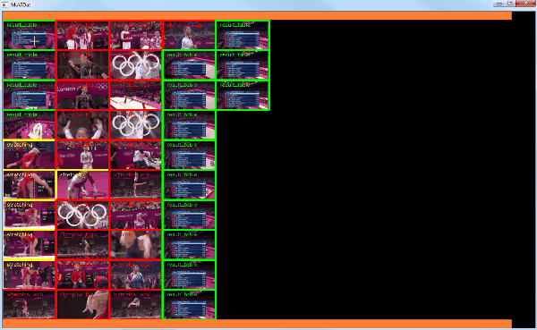

# MuViLab
**MU**ltiple **VI**deos **LAB**elling tool is a manual [annotation tool](https://en.wikipedia.org/wiki/List_of_manual_image_annotation_tools) to help you labelling videos for computer vision, machine learning and AI applications. With MuViLab you can annotate hours of videos in just a few minutes!

## Key features
- Show several video clips on screen, simultaneously, in loop
- Create labels with a simple click
- Designed for labelling a few events among many negative examples (i.e. lightinings in a video of weather monitoring)
- Export annotation in json
- Review labels in a single page

Once you annotate your videos, you can use any stardard library like [Tensorflow](https://www.tensorflow.org/) to train your algorithm.

## Why use MuViLab?
### Several hours of repetitive video
Immagine you've got days or months of video recording from some source (e.g. video surveillance, health monitoring, weather webcam...) and you're interested in an algorithm that classifies a specific event (e.g. a red car crosses the street, a thunder in the sky...). With standard annotation tools, you have to watch the entire video to observe and label the event. Sometimes, the event you're annotating is so quick that you cannot even speed up your videos, requiring you to watch them at normal speed.

With MuViLab, you can split your long video into short clips of 3-4 seconds, which are shown simultaneously in loop on screen. **With a single glance, you'll be able to identify your event in ~100 clips, speeding up your job by almost 100 times!**


After annotating your videos, you can use the *review function* to check and modify your labels:


## Installation
Simply install the following required pagackes:

    $ pip install opencv-python numpy pytube
    
and run the demo:

    $ python demo.py

## Usage
To start MuViLab, simply import the class Annotator in your script, set up the labels and run the main():

```python
from annotator import Annotator
annotator = Annotator([
        {'name': 'text_of_label_1', 
        'color': (0, 1, 0),
        'event': cv2.EVENT_LBUTTONDOWN},

        {'name': 'text_of_label_2', 
        'color': (0, 0, 1),
        'event': cv2.EVENT_LBUTTONDBLCLK},
         
         {'name': 'text_of_label_3', 
        'color': (0, 1, 1),
        'event': cv2.EVENT_MBUTTONDOWN}
        ], clips_folder, N_show_approx=100,
        annotation_file='my_labels.json')

annotator.main()
```

For a full list of possible events, please check [here](https://docs.opencv.org/3.1.0/d7/dfc/group__highgui.html#ga927593befdddc7e7013602bca9b079b0).

While running, the following commands will be accepted:
- **n**: Go to the **n**ext page
- **b**: Go **b**ack to the previous page
- **r**: Enter **r**eviewing mode
- **q**: **Q**uit the program

## License
MuViLab was developed while working for the SPHERE IRC project. 
MuViLab is freely available for free non-commercial use, and may be redistributed under these conditions.
